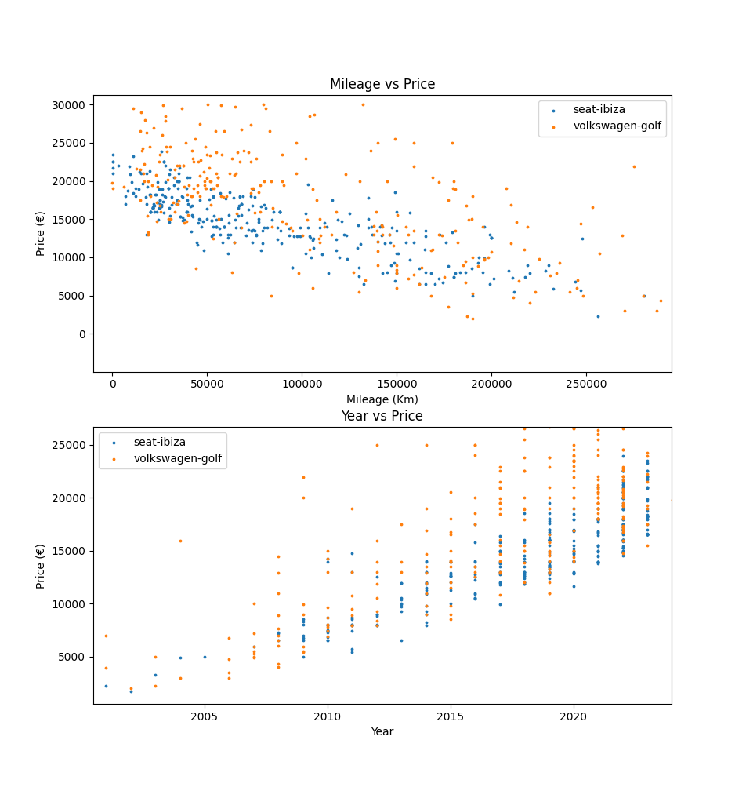

# Autoprice - Automobile second hand market hub

## Overview

Autoprice allows for:

1. Gathering car information from [standvirtual](https://www.standvirtual.com/)
2. Persistently storing the car data
3. Plotting and comparing different cars' price against different attributes

https://github.com/mantinhas/autoprice/assets/54488939/b1725302-a87c-489a-83a7-106c7dd81056




## Motives

I initially developed this project sometime around 2021, in order to:

+ Study the $2^{nd}$ hand car market in Portugal
+ Make an informed decision for when I bought my $1^{st}$ car
+ Gain experience and dexterity web scraping

This week I decided to update my old code, _dockerize_ it and publish it online

## Usage

The script has a frontend app called `src/main.py`. Run `python src/main.py --help` for more detailed information.

This frontend has 4 main commands (all these commands also support the `--help` flag):

+ `pull` - Scrape car listings for a specific brand and model, and store this data persistently
+ `list` - List all stored car listings
+ `plot` - Plot one or more car listings
+ `run` - It serves as a `pull`+`plot`, but will use previously downloaded car listings if available

`run` is the easier command to use and I heavily encourage it

### Examples

#### Pulling and plotting Seat Ibiza listings:

Start by pulling the listings from the website

```
$ python src/main.py pull seat ibiza
```

Check the available downloaded files
```
$ python src/main.py list
pickles/seat-ibiza.pkl
```

Plot the file
```
$ python src/main.py plot pickles/seat-ibiza.pkl
```

Now, you can open the `.png` file saved in `plots/`. Alternatively, for interactive plots run (WARNING: this does not work for docker deployment):
```
$ python src/main.py plot pickles/seat-ibiza.pkl --no-headless
```

#### Plotting and comparing all downloaded cars:

```
$ python src/main.py plot pickles/*
```


## Deployment

### Using Docker

For building the Autoprice docker image. WARNING: Docker container does not support interactive plots (only static) nor visual feedback for data scraping (headless scraping)
```
docker build -t autoprice .
```

For running the Autoprice container with persistent shared containers
```
docker run -it --name="autoprice" \
    --mount type=bind,source="$(pwd)"/plots,target=/app/plots \
    --mount type=bind,source="$(pwd)"/pickles,target=/app/pickles autoprice
```

### Manually

Autoprice requires the following packages:

+ `python3` (tested for version 3.11)
+ `firefox` (tested for version 122.0.1)
+ `firefox-geckodriver` (tested for version 0.34.0)

Install the necessary python libraries by running:
```
$ pip install -r requirements.txt
```
